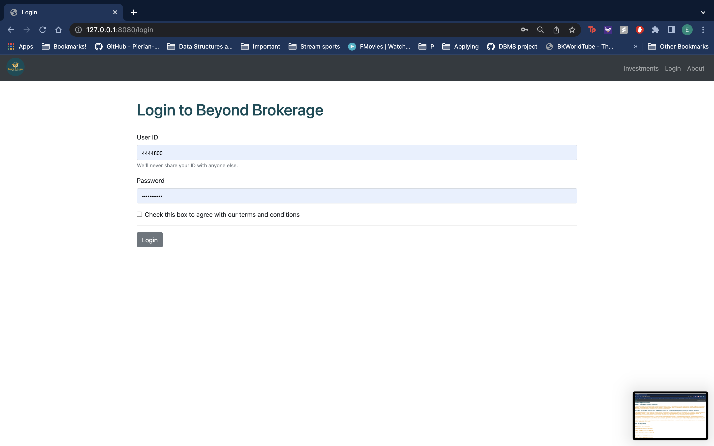

# Firm-DBMS

# FIRM-DBMS

## Introduction

> Devised a web application that allows users to purchase and sell "Investments/Stocks" that the fictitious company "Beyond Brokerage" has to offer.
> Reads data from a database.

## Features
> Has session management, which allows access to managers, brokers and clients, each having different views and roles.
> Managers not only manage their branch (hire or fire brokers who work under them) but can also add and remove Investments.
> Brokers manage their clients and are tasked with updating the price of Investments, as they are dynamic.
> Clients can purchase and sell stocks. Whatever transaction they perform reflects instantly on their account.

## Technologies

> Used MySQL to perform queries on the database.
> Integrated Flask to make the web application, along with HTML and CSS.
> Used Python on the backend.

## Screenshots
> 

## Installation

> Feel free to use the code with your own database. Our SQL statements to make and populate the database can be found here [Database](https://github.com/easeghehey/Firm-DBMS/blob/main/sql%20statements/allinone)
